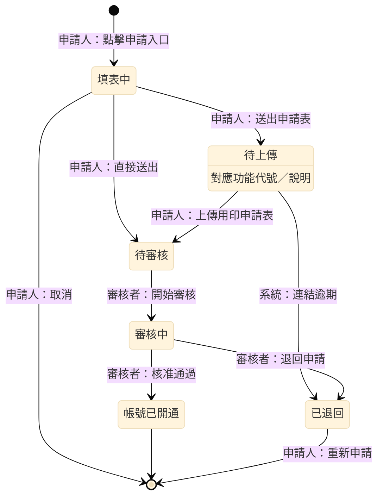
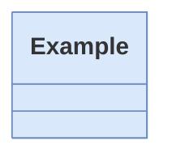
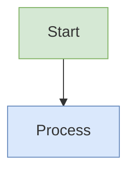

# UML Diagram Generator (Mermaid)
**Quick Start:** Choose diagram type → Write Mermaid text → Define elements and relationships → Wrap in ` ```mermaid ` fence.
> ⚠️ **IMPORTANT:** Always use ` ```mermaid ` code fence. NEVER use ` ```text ` — it will NOT render as a diagram.

## Critical Rules

- Every diagram starts with its **diagram type keyword** (e.g., `classDiagram`, `sequenceDiagram`, `flowchart TD`)
- No `@startuml` / `@enduml` — Mermaid uses the keyword alone
- Use `%%{init: {...}}%%` directive at the top for theming (optional)
- Comments use `%%` prefix: `%% this is a comment`
- Direction keywords: `TD` (top-down), `LR` (left-right), `BT` (bottom-top), `RL` (right-left)

## UML Diagram Types

| Type | Mermaid Keyword | Purpose | Example |
|------|----------------|---------|---------|
| Class | `classDiagram` | Class structure and relationships | [class-diagram.md](examples/class-diagram.md) |
| Sequence | `sequenceDiagram` | Message interactions over time | [sequence-diagram.md](examples/sequence-diagram.md) |
| Flowchart | `flowchart TD` | Workflow and process flow | [flowchart-diagram.md](examples/flowchart-diagram.md) |
| Swimlane Flowchart | `flowchart TD` + subgraph | Multi-role flowchart with lanes | [swimlane-flowchart.md](examples/swimlane-flowchart.md) |
| State Machine | `stateDiagram-v2` | Object lifecycle states | [state-machine-diagram.md](examples/state-machine-diagram.md) |
| Component | `block-beta` | System component organization | [component-diagram.md](examples/component-diagram.md) |
| Use Case | `flowchart LR` | User-system interactions | [use-case-diagram.md](examples/use-case-diagram.md) |
| Deployment | `block-beta` / C4 | Physical deployment architecture | [deployment-diagram.md](examples/deployment-diagram.md) |
| Object | `classDiagram` | Runtime object snapshot | [object-diagram.md](examples/object-diagram.md) |
| Package | `classDiagram` + namespace | Module organization | [package-diagram.md](examples/package-diagram.md) |
| ER Diagram | `erDiagram` | Database entity relationships | [er-diagram.md](examples/er-diagram.md) |

## SA 文件活動圖規範

### 節點標籤通用規則

- **禁止在任何節點標籤或 transition label 中使用 `\n`**：不同渲染器行為不一致，會直接字面輸出 `\n` 或導致解析失敗。
- 需要換行時，改用簡短單行標籤，必要資訊移至圖例說明或備註。
- `stateDiagram-v2` 的 transition label（`: text` 部分）額外禁止使用冒號 `:`（如時間格式 `23:59`），因解析器以第一個 `:` 切割 label，冒號出現在值中會導致整張圖渲染失敗。
- 特殊全形字元（如 `～`、`＋` 等）在 stateDiagram-v2 中可能造成解析問題，應避免用於 transition label，改用一般文字描述。
- `flowchart` 中的 subgraph 僅在內部有 **2 個以上節點**時才加 `direction TB`；單一節點的 subgraph 加 `direction TB` 會導致外框邊界錯位，應省略。
- subgraph 標題**禁止使用 `數字.` + 空格的格式**（如 `"3. 系統管理"`），Mermaid 會將其解析為 Markdown 有序清單，拋出 "Unsupported markdown: list" 錯誤。改用不含句號的格式（如 `"3 系統管理"`）。

---

### 狀態機（State Machine）

- **一律使用 `state "顯示文字" as alias` 宣告所有狀態**，以英文 alias 作為圖中識別子，完全避免中文 identifier 在 `note right of` 等語法中的解析風險。
- 以 `alias : 說明文字` 取代 `note right of`，在 state description 中補充限定條件或備注。
- **操作人員標示規則（Actor 前綴）**：
  - **State name**：只寫狀態名稱，**不加 Actor 前綴**。
  - **Transition label**：格式為 `alias --> alias2 : Actor：動作`，在線條上標示誰觸發了此轉換。
  - Actor 與動作之間使用**全形冒號 `：`**，與 stateDiagram-v2 的 transition 分隔符（半形 `:`）不同，不會造成解析衝突。
- 角色命名（範例）：`申請人`、`系統`、`管理員`、`審核者`，實際依專案角色調整。

**範例（申請案件狀態）**：


---

### 活動圖（Activity Diagram）

- **一律使用 `flowchart TD`（直向，由上而下）**，禁止使用 `flowchart LR`
- 不使用泳道（subgraph swimlane），改以 classDef 色彩區分角色
- 角色色彩規範：

| 角色 | fill | stroke | classDef |
|------|------|--------|----------|
| 申請人 / 使用者 | `#d5e8d4` | `#82b366` | `green` |
| 系統 | `#dae8fc` | `#6c8ebf` | `blue` |
| 管理員 | `#e1d5e7` | `#9673a6` | `purple` |
| 判斷節點 | `#fff2cc` | `#d6b656` | `yellow` |
| 錯誤 / 失敗 | `#f8cecc` | `#b85450` | `red` |

- 圖前加顏色圖例說明，例如：
  `> 顏色圖例：🟢 申請人　🔵 系統　🟣 管理員　🟡 判斷　🔴 錯誤／失敗`

---

## Theming

Use `%%{init: ...}%%` directive to set themes or config:



Available themes: `default`, `base`, `dark`, `forest`, `neutral`

For custom colors on individual nodes, use `style` or `classDef` (flowchart) or inline `:::className`:



## Node Shapes (Flowchart)

| Shape | Syntax | Description |
|-------|--------|-------------|
| Rectangle | `[text]` | Default process step |
| Rounded | `(text)` | Soft process |
| Stadium/Pill | `([text])` | Start/End terminal |
| Subroutine | `[[text]]` | Pre-defined process |
| Cylinder | `[(text)]` | Database |
| Circle | `((text))` | Event/connector |
| Diamond | `{text}` | Decision |
| Hexagon | `{{text}}` | Preparation |
| Parallelogram | `[/text/]` | Input/Output |

## Relationship Syntax (Class Diagram)

| Relationship | Syntax | Description |
|---|---|---|
| Inheritance | `<\|--` | Hollow triangle (extends) |
| Realization | `..\|>` | Dashed + hollow triangle (implements) |
| Composition | `*--` | Filled diamond (owns) |
| Aggregation | `o--` | Hollow diamond (has-a) |
| Association | `-->` | Open arrow |
| Dependency | `..>` | Dashed open arrow |
| Link (solid) | `--` | Undirected |
| Link (dashed) | `..` | Undirected dashed |
