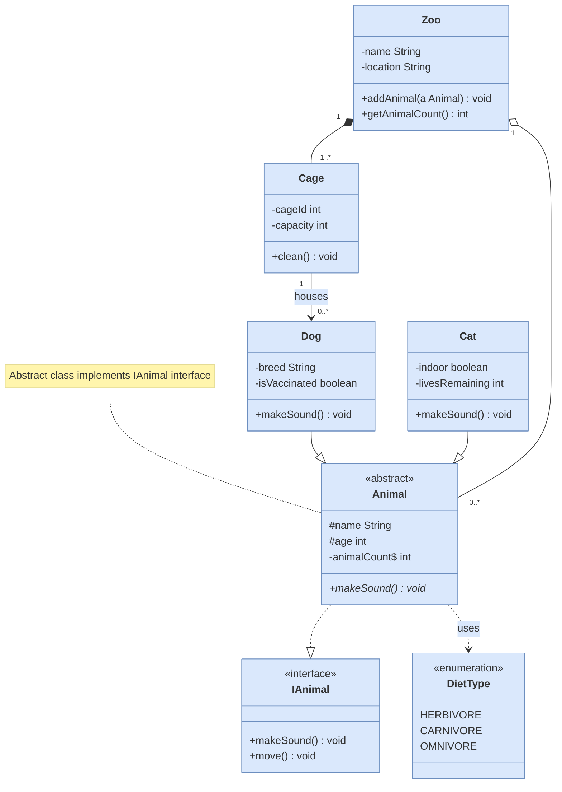
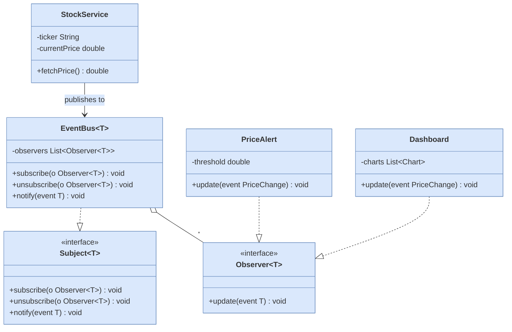

# Class Diagram

Shows class structure with attributes, methods, and relationships between classes.

## Key Elements

- **Class**: `class ClassName { }` — define attributes and methods inside braces
- **Abstract class**: add `<<abstract>>` annotation inside class
- **Interface**: add `<<interface>>` annotation inside class
- **Enumeration**: add `<<enumeration>>` annotation inside class
- **Visibility**: `+` public, `#` protected, `-` private, `~` package
- **Static member**: `$` suffix on member
- **Abstract method**: `*` suffix on method

## Relationships

| Relationship | Syntax | Description |
|---|---|---|
| Inheritance | `<\|--` | Hollow triangle (extends) |
| Realization | `..\|>` | Dashed + hollow triangle (implements) |
| Association | `-->` | Open arrow |
| Aggregation | `o--` | Hollow diamond (has-a) |
| Composition | `*--` | Filled diamond (owns) |
| Dependency | `..>` | Dashed open arrow (uses) |

## Recommended Colors (via classDef)

| Element | Fill | Stroke | Usage |
|---|---|---|---|
| Interface | `#d5e8d4` | `#82b366` | Contract definitions |
| Abstract class | `#f8cecc` | `#b85450` | Base classes |
| Concrete class | `#dae8fc` | `#6c8ebf` | Regular classes |
| Enum | `#fff2cc` | `#d6b656` | Enumerations |
| Subclass | `#ffe6cc` | `#d79b00` | Derived classes |
| Utility | `#e1d5e7` | `#9673a6` | Utility/helper classes |

## Example 1

Zoo management system with interfaces, abstract class, enums, and various relationships:

## Example 2

Observer pattern with generic types and dependency relationships:

