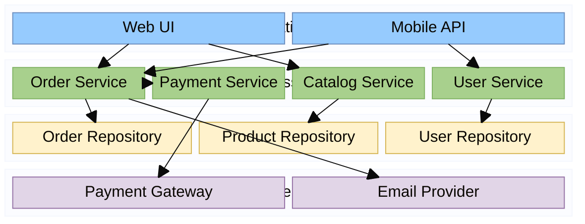
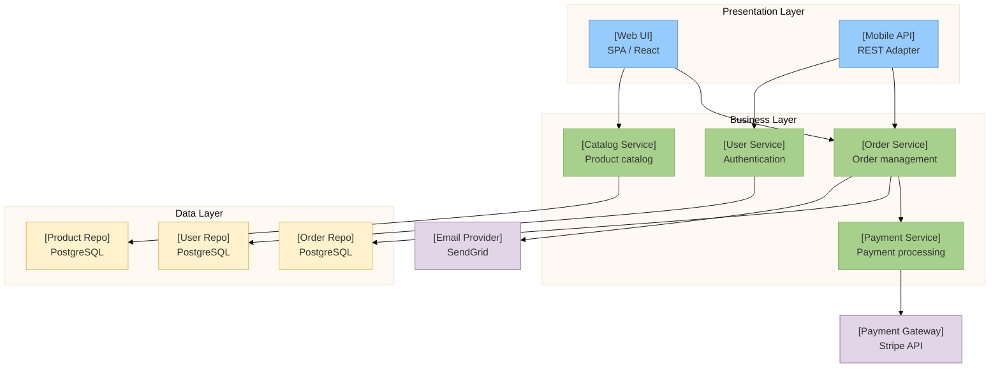

# Component Diagram

Shows system component organization, interfaces, and dependencies.

## Approach in Mermaid

Mermaid uses **`block-beta`** for component/architecture diagrams.  
For C4-style architecture, use `C4Component` or `C4Context` diagrams.

## block-beta Syntax

```
block-beta
  columns N
  A["Label"]:width   %% width in columns
  B["Label"]
  A --> B
```

- `columns N` — set grid column count
- `block:id ... end` — grouped sub-block
- `NodeID["Label"]:N` — node spanning N columns
- Arrow types: `-->`, `--`, `-.->`, `==>`
- Add `style NodeID fill:#color,stroke:#color` for colors

## Recommended Colors

| Element | Fill | Stroke | Usage |
|---|---|---|---|
| Core component | `#dae8fc` | `#6c8ebf` | Main business logic |
| Service component | `#d5e8d4` | `#82b366` | Service layer |
| Data component | `#fff2cc` | `#d6b656` | Data access/storage |
| External component | `#e1d5e7` | `#9673a6` | External/third-party |
| Package boundary | `#f5f5f5` | `#cccccc` | Subsystem boundaries |

## Example 1

E-commerce system with layered components and dependencies:



## Example 2

C4-style component diagram using flowchart:


