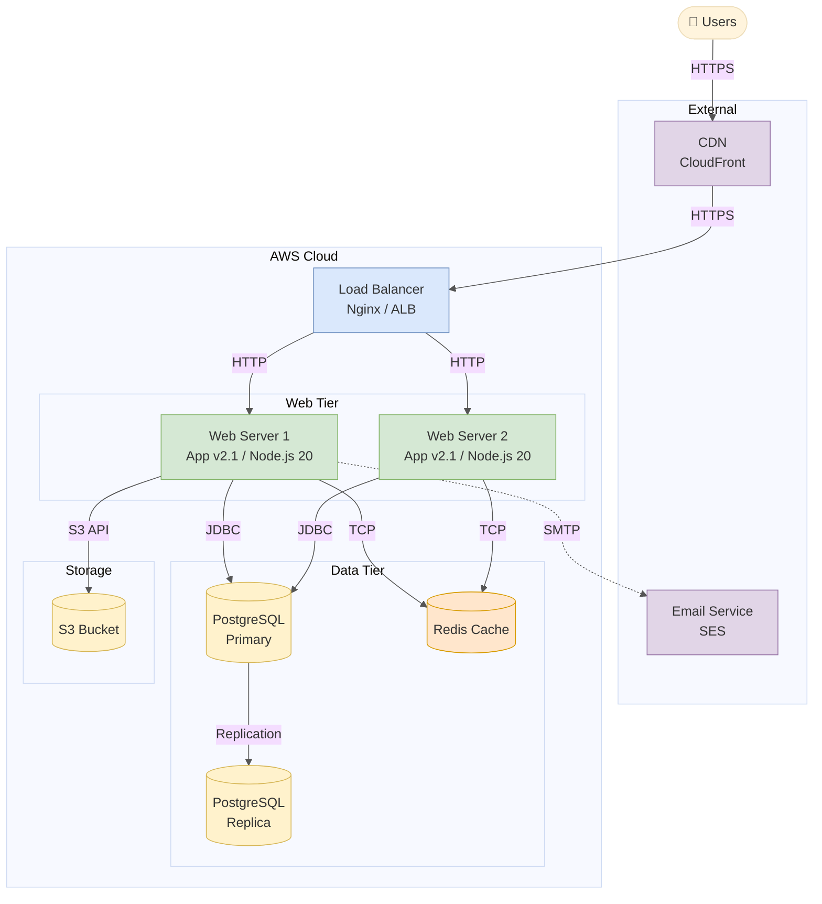
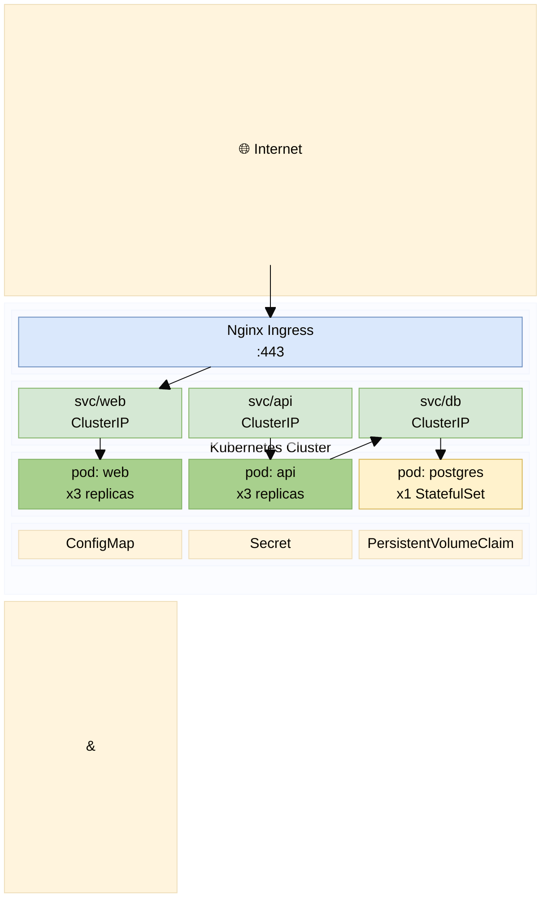

# Deployment Diagram

Shows physical deployment architecture of the system.

## Approach in Mermaid

Use **`block-beta`** for clean deployment boxes, or **`flowchart TD`** with subgraphs for named environments. C4 `C4Deployment` is also available for formal deployment diagrams.

## Recommended Colors

| Element | Fill | Stroke | Usage |
|---|---|---|---|
| Load balancer | `#dae8fc` | `#6c8ebf` | Entry point / routing |
| Web/App server | `#d5e8d4` | `#82b366` | Application servers |
| Database | `#fff2cc` | `#d6b656` | Data storage |
| Cache | `#ffe6cc` | `#d79b00` | Caching layer |
| External service | `#e1d5e7` | `#9673a6` | Third-party |
| Cloud boundary | `#f5f5f5` | `#cccccc` | Cloud/environment boundary |

## Example 1

AWS deployment with load balancer, app servers, and database cluster (flowchart):

## Example 2

Kubernetes deployment with block-beta:

