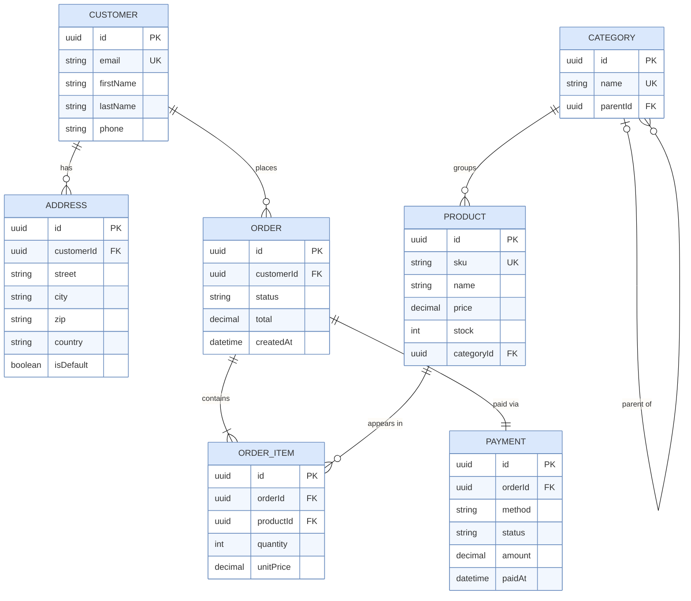
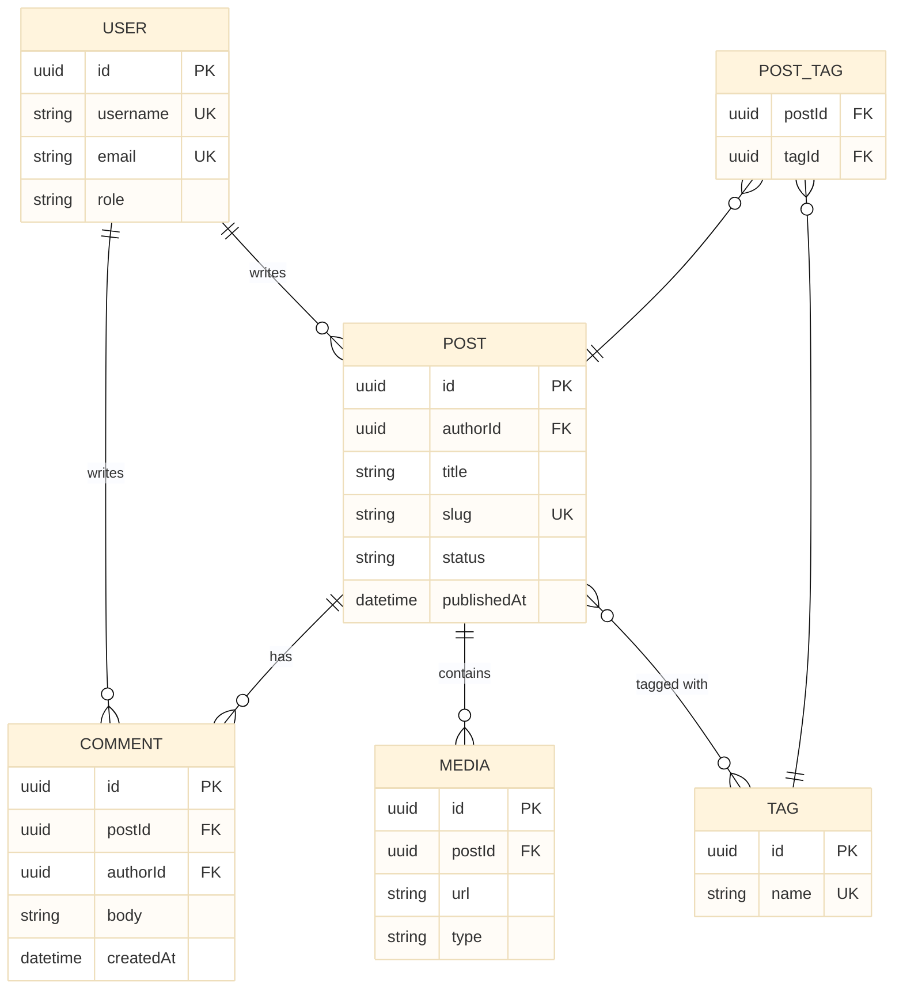

# ER Diagram (Entity-Relationship)

Shows database entities, attributes, and their relationships.  
This is a Mermaid-native diagram type with no PlantUML equivalent.

## Key Elements

- **Entity**: `ENTITY_NAME { ... }` — table/entity rectangle
- **Attribute**: `type name PK/FK/UK` — column inside entity
- **Relationship**: `A ||--o{ B : "label"` — connecting line
- **Relationship direction**: always left to right

## Relationship Cardinality

| Symbol | Meaning |
|---|---|
| `\|o` | Zero or one |
| `\|\|` | Exactly one |
| `o{` | Zero or many |
| `\|{` | One or many |

Combine left and right sides:
| Syntax | Meaning |
|---|---|
| `\|\|--\|\|` | exactly one — exactly one |
| `\|\|--o{` | exactly one — zero or many |
| `\|\|--\|{` | exactly one — one or many |
| `o\|--o{` | zero or one — zero or many |

## Attribute Types

Common type names: `int`, `string`, `varchar`, `boolean`, `decimal`, `datetime`, `uuid`, `json`

Modifiers: `PK` (primary key), `FK` (foreign key), `UK` (unique key)

## Example 1

E-commerce database schema:

## Example 2

Blog platform schema:

