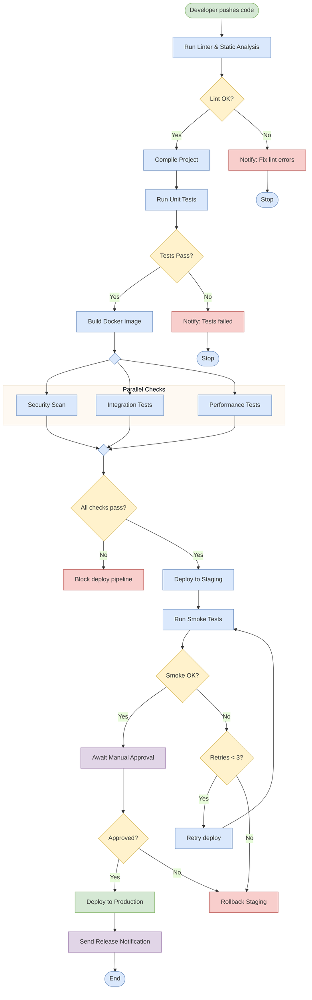

# Flowchart Diagram (Activity)

Shows workflow with activities, decisions, loops, and parallel processing.

## Key Elements

- **Start/End**: `([text])` — stadium/pill shape
- **Activity**: `[text]` — rectangle
- **Decision**: `{text}` — diamond
- **Database/Cylinder**: `[(text)]` — cylinder
- **Parallel / Fork**: Use `subgraph` blocks side-by-side
- **Direction**: `TD` (top-down), `LR` (left-right), `BT` (bottom-top)

## Node Shapes

| Shape | Syntax | Usage |
|---|---|---|
| Rectangle | `[text]` | Process step |
| Rounded rect | `(text)` | Soft action |
| Stadium/Pill | `([text])` | Start / End |
| Diamond | `{text}` | Decision |
| Cylinder | `[(text)]` | Database |
| Circle | `((text))` | Connector / Event |
| Hexagon | `{{text}}` | Preparation |
| Parallelogram | `[/text/]` | Input / Output |
| Subroutine | `[[text]]` | Pre-defined process |

## Edge Styles

| Type | Syntax | Description |
|---|---|---|
| Solid arrow | `-->` | Default flow |
| Labeled arrow | `-- label -->` or `-->|label|` | Arrow with guard label |
| Thick arrow | `==>` | Emphasized flow |
| Dotted arrow | `-.->` | Optional/async flow |
| No arrowhead | `---` | Link without direction |

## Recommended Colors (classDef)

| Element | Fill | Stroke | Usage |
|---|---|---|---|
| Start/receive | `#d5e8d4` | `#82b366` | Input/receive actions |
| Process | `#dae8fc` | `#6c8ebf` | Processing steps |
| Decision | `#fff2cc` | `#d6b656` | Branch points |
| Error/Cancel | `#f8cecc` | `#b85450` | Error handling |
| Output | `#e1d5e7` | `#9673a6` | Results/output |

## Example 1

CI/CD pipeline with decisions, parallel stages, and loops:

