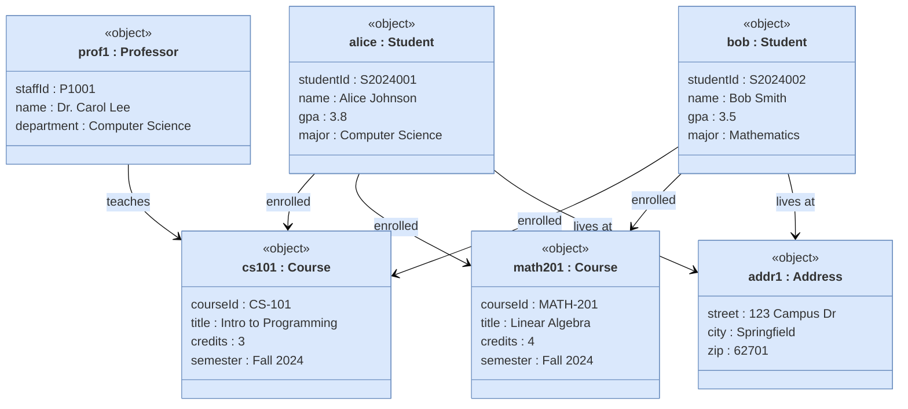
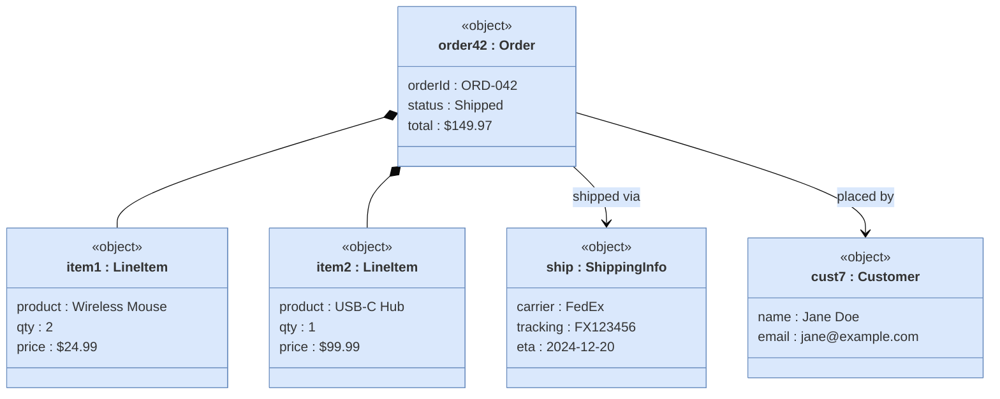

# Object Diagram

Shows instances (objects) and their attribute values at a specific point in time.

## Approach in Mermaid

Use **`classDiagram`** with `<<object>>` annotation to represent instances.  
Attributes are listed inside the class body as `fieldName = "value"` style entries.

## Key Elements

| Element | Mermaid Syntax | Description |
|---|---|---|
| Object | `class "name : ClassName"` with `<<object>>` | Instance with class type |
| Attribute value | `fieldName : value` inside class body | Attribute assignment |
| Link | `obj1 --> obj2 : label` | Association between instances |
| Composition | `obj1 *-- obj2` | Ownership link |

## Recommended Colors (classDef or style)

| Element | Fill | Stroke | Usage |
|---|---|---|---|
| Entity object | `#dae8fc` | `#6c8ebf` | Domain objects |
| Value object | `#d5e8d4` | `#82b366` | Value types |
| Reference object | `#fff2cc` | `#d6b656` | Referenced entities |
| Collection | `#ffe6cc` | `#d79b00` | Lists/sets |
| Config object | `#e1d5e7` | `#9673a6` | Configuration |

## Example 1

University system snapshot showing students, courses, and their relationships:

## Example 2

E-commerce order snapshot with composed objects:

