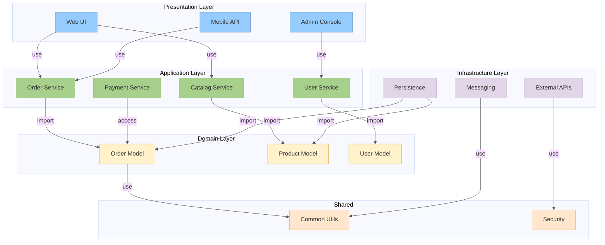
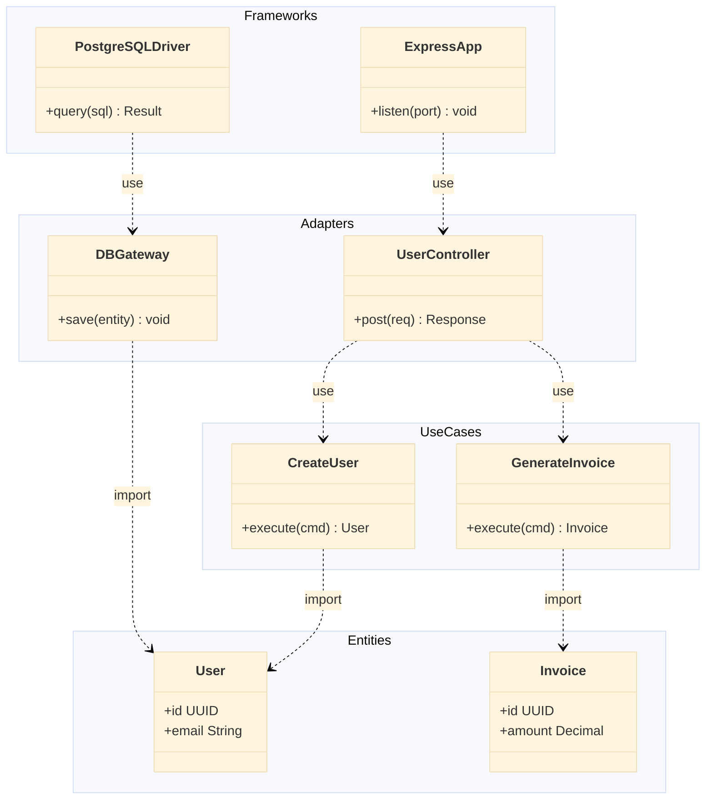

# Package Diagram

Shows the modular organization structure of a system.

## Approach in Mermaid

Use **`classDiagram`** with `namespace` blocks to represent packages/modules.  
For higher-level architecture layers, use `flowchart TD` with nested subgraphs.

## classDiagram namespace Syntax

```
classDiagram
  namespace PackageName {
    class ComponentA
    class ComponentB
  }
  namespace AnotherPackage {
    class ComponentC
  }
  ComponentA ..> ComponentC : use
```

## flowchart Subgraph Syntax (for layered packages)

```
flowchart TD
  subgraph Layer["Layer Name"]
    subgraph Pkg["Package"]
      A["Module"]
    end
  end
```

## Dependency Stereotypes

| Stereotype | Arrow + Label | Description |
|---|---|---|
| `<<use>>` | `..>` | Usage dependency |
| `<<import>>` | `..>` | Package imports another |
| `<<access>>` | `..>` | Restricted access |
| `<<merge>>` | `..>` | Package merge |

## Recommended Colors (classDef / style)

| Layer | Fill | Stroke | Usage |
|---|---|---|---|
| Presentation | `#96CBFE` | `#6c8ebf` | UI layer |
| Application | `#A8D08D` | `#82b366` | Service/business layer |
| Domain | `#fff2cc` | `#d6b656` | Domain model |
| Infrastructure | `#e1d5e7` | `#9673a6` | Data/external access |
| Shared/Common | `#ffe6cc` | `#d79b00` | Cross-cutting concerns |

## Example 1

E-commerce system module structure with layered architecture (flowchart):



## Example 2

Clean Architecture using `classDiagram` with namespaces:


