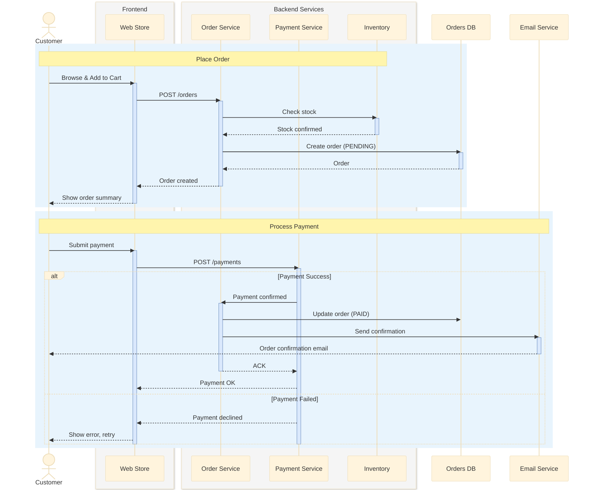
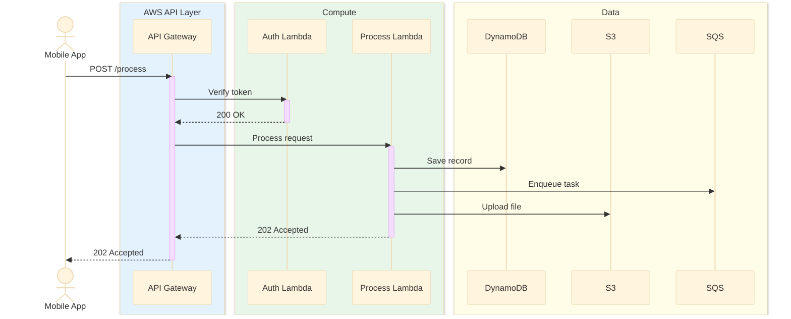

# Sequence Diagram

Shows message interactions between objects in chronological order.

## Key Elements

- **Participant**: `participant Name as alias` — rectangle lifeline
- **Actor**: `actor Name as alias` — stick figure lifeline
- **Box group**: `box "Label" #color ... end box` — group participants
- **Activation**: `activate` / `deactivate` or `+` / `-` shorthand
- **Create**: `create participant Name` — creates new object
- **Destroy**: `destroy Name` — destroys object (X mark)
- **Note**: `Note right of A: text` or `Note over A,B: text`

## Message Types

| Message | Syntax | Description |
|---|---|---|
| Synchronous | `->>` | Solid line, filled arrowhead |
| Synchronous (no arrow) | `->` | Solid line, open arrowhead |
| Return / async reply | `-->>` | Dashed line, filled arrowhead |
| Return (no arrow) | `-->` | Dashed line, open arrowhead |
| Cross (lost) | `-x` | Solid line with X |
| Cross dashed | `--x` | Dashed line with X |
| Open async | `-)` | Solid line, open circle arrow |
| Open async dashed | `--)` | Dashed line, open circle arrow |

## Combined Fragments

| Fragment | Syntax | Description |
|---|---|---|
| alt/else | `alt ... else ... end` | Alternative (if-else) |
| opt | `opt ... end` | Optional (if) |
| loop | `loop ... end` | Loop iteration |
| par | `par ... and ... end` | Parallel execution |
| critical | `critical ... option ... end` | Critical section |
| break | `break ... end` | Break out |

## Recommended Colors (box backgrounds)

| Element | Color | Usage |
|---|---|---|
| Frontend | `#e8f4fd` (sky blue) | UI components |
| Backend | `#e8f6e8` (sage green) | Server/service |
| Data | `#fef9e7` (peach/yellow) | Data storage |
| External | `#f4ecf7` (lavender) | Third-party services |

## Example 1

E-commerce order processing with multiple participants and fragments:

## Example 2

AWS serverless API flow with activation bars and loop:

