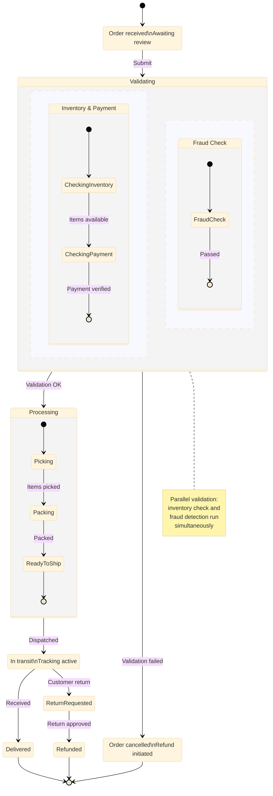
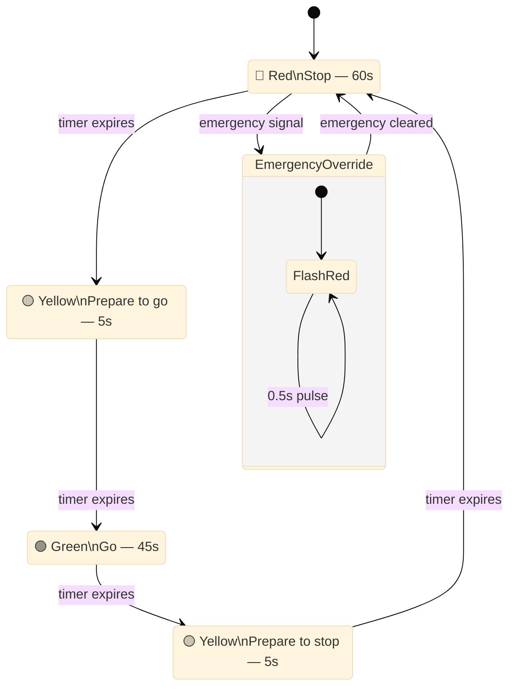

# State Machine Diagram

Shows state changes of an object during its lifecycle.

## Key Elements

- **State**: `StateName` or `state "Long Name" as alias` — rounded rectangle
- **Initial state**: `[*] -->` — solid black circle
- **Final state**: `--> [*]` — circle with outer ring
- **Transition**: `State1 --> State2 : event` — labeled arrow
- **Composite state**: `state StateName { ... }` — container with substates
- **Choice / Fork / Join**: `state id <<choice>>` / `<<fork>>` / `<<join>>`
- **Concurrency**: `--` inside composite state separates parallel regions
- **Notes**: `note right of StateName : text`
- **Direction**: `direction LR` inside composite state

## Recommended Colors

Mermaid `stateDiagram-v2` doesn't support per-state colors via inline syntax — use `%%{init}%%` theme variables or `classDef` with `:::` notation (experimental).

For color-coding, add comments to document intent:

| State Type | Theme suggestion | Usage |
|---|---|---|
| Pending/Idle | Blue tone | Waiting states |
| Active/Processing | Yellow tone | In-progress states |
| Success/Complete | Green tone | Successful outcomes |
| Error/Cancel | Red tone | Error/failure states |
| Final/Archive | Purple tone | Terminal states |

## Example 1

Order processing state machine with composite states and parallel regions:

## Example 2

Traffic light state machine with choice and timed transitions:

