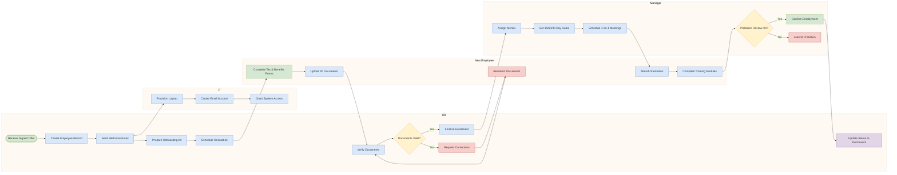

# Swimlane Flowchart

Shows workflow partitioned by roles or services using subgraph lanes.

## Key Elements

- **Lane**: `subgraph LaneName[Lane Label]` — vertical or horizontal partition
- **Lane direction**: Set `flowchart LR` for vertical swimlanes, `flowchart TD` for horizontal
- All flowchart node shapes and edge styles apply inside lanes
- Arrows can cross lane boundaries freely

## Swimlane Syntax

```
flowchart LR
  subgraph Lane1[Role / Service]
    direction TB
    A[Step] --> B[Step]
  end
  subgraph Lane2[Another Role]
    direction TB
    C[Step]
  end
  B --> C
```

## Recommended Colors (classDef)

| Element | Fill | Stroke | Usage |
|---|---|---|---|
| Start/receive | `#d5e8d4` | `#82b366` | Input/receive actions |
| Process | `#dae8fc` | `#6c8ebf` | Processing steps |
| Decision | `#fff2cc` | `#d6b656` | Branch points |
| Error/Cancel | `#f8cecc` | `#b85450` | Error handling |
| Output | `#e1d5e7` | `#9673a6` | Results/output |

## Example 1

Employee onboarding across HR, IT, Manager, and New Employee lanes:


