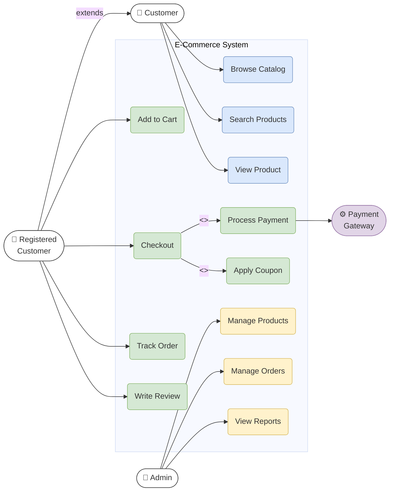
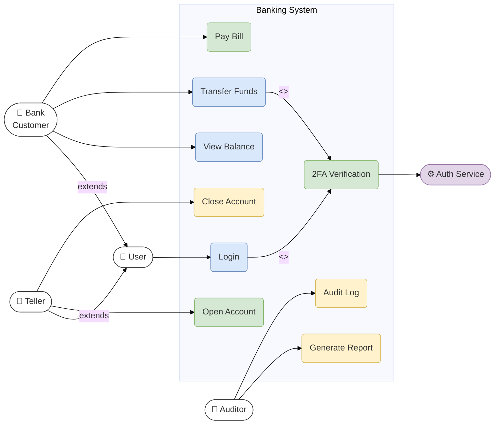

# Use Case Diagram

Describes system functional requirements and user interactions.

## Approach in Mermaid

Mermaid does not have a native use case diagram type.  
Use **`flowchart LR`** to approximate use case diagrams with:
- Actor shapes: `Actor(["👤 Actor Name"])` — stadium shape
- Use case shapes: `UC("Use Case")` — rounded rect
- System boundary: `subgraph System[System Name]`
- Associations: `-->` (solid line)
- Include/Extend: `-->|<<include>>|` / `-->|<<extend>>|`
- Generalization: `-->` with label

## Recommended Colors (classDef)

| Element | Fill | Stroke | Usage |
|---|---|---|---|
| Primary actor | `#ffffff` | `#333333` | Main users |
| System actor | `#e1d5e7` | `#9673a6` | External systems |
| Core use case | `#dae8fc` | `#6c8ebf` | Primary functions |
| Secondary use case | `#d5e8d4` | `#82b366` | Supporting functions |
| Admin use case | `#fff2cc` | `#d6b656` | Management functions |

## Example 1

E-commerce system use cases with multiple actor types and relationships:

## Example 2

Banking system with actor generalization and include/extend relationships:

